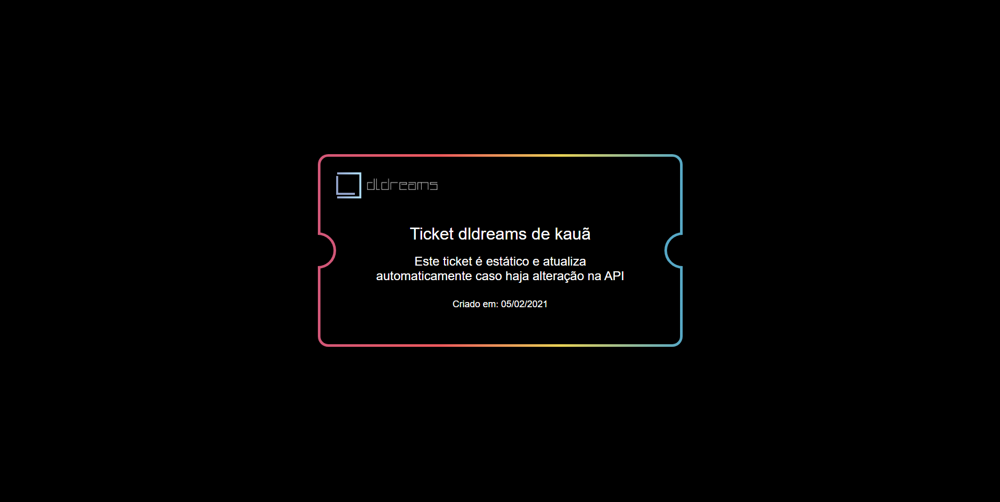

<h1 style="text-align: center">
  
</h1>

# Página estática que atualiza sozinha

Este é um exemplo de página estática que atualiza sozinha utilizando a tecnologia de SSG do Next.js



Para exemplificar essa funcionalidade do Next utilizamos um ticket que atualiza suas informações caso haja uma alteração pela API

<!-- ## Vídeo no youtube

Temos um video em nosso canal do youtube ensinando passo a passo de como criar esse ticket

- [Vídeo](https://youtube.com/) -->

## Como usar?

```bash
$ npm i
$ npm run run:api
$ npm run run:app
# ou
$ yarn i
$ yarn run:api
$ yarn run:app
```

Depois acesse o arquivo `api.json` e copie um "username" de algum usuario lá dentro e cole na sua url. Ex: `http://localhost:3333/kauadev`

Após acessar o ticket vá no arquivo `api.json` e altere por exemplo o "name" desse usuario e dê F5 na página do ticket e pronto!
